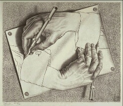
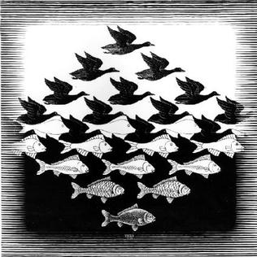

+++
title = "G.E.B. —— A Mental Space Odyssey"
date = 2020-08-25
[taxonomies]
tags = ["geb", "book", "review"]
[extra]
headline = "评《哥德尔、埃舍尔、巴赫——集异璧之大成》"
math = true
comment = true
+++

《哥德尔、埃舍尔、巴赫——集异璧之大成》是一本能让人手不释卷的有趣的书。希望这篇简短的读后感能让更多人对这本书产生兴趣。

<!--more-->

初次翻开这本书，可能会被作者侯世达惊人的博识震惊到。作者在音乐、美术、逻辑学、计算理论甚至语言学、生物学间来去自如，文字运用游刃有余。我对巴赫的音乐和埃舍尔的美术不甚了了，但作者可以通过清晰易懂的文字将不同艺术形式间内蕴的相似性传达给我，让人大开眼界、不忍释卷。可是，这本书在讲什么呢？这是一本数学/计算机/AI/逻辑的科普书吗？

我个人的总结是，这本书的核心是人的认知和思维的本质与再现（即人工智能的实现）。而作者则认定神秘的自指与递归是核心，并就此展开了心智空间的奥德赛[^1]。

# 内容概述

本书分为两个部分。

1. 第一部分为读者打下理论基础，旋风般地介绍了形式系统、递归、原始递归、完全性、一致性、递归性、递归可枚举性、编码等诸多概念。最终以哥德尔不完备性定律终结。
2. 第二部分是作者写这本书的目的。作者试图探讨思维和智能的本质，批判了朴素的灵性论、机械论，同时提出了自己的较乐观的观点。

这一节仅仅表达我对作者行文的一些印象（不是总结！），挂一漏万。想要看比较全面的内容小结，可以直接翻阅本书目录，作者已经整理好了。

## 第一部分

我对第一部分介绍的理论已经相当了解，所以浏览得极快，可以说只是在与作者对照脑中已有的想法。但非常难能可贵的是，侯世达没有因为这些内容基础就跳过各种概念的细致讲解（通常教科书会在开头辟一章「预备知识」，列举书中用到的所有工具）。尽管牺牲了技术性的细节，但作者选取比喻的准确和启发性频频让我叫绝，对各种概念的探讨也到了令人吃惊的深度。这本书无疑覆盖了数理逻辑入门的一切重要结论。哪怕我已经知道了这些结论，也常常学到不一样的视角。

试举一例。第 3 章《图形与衬底》讨论了「非定理」[^2]的生成。如果我们把一个形式系统生成的定理看作图形，那么它生成不出来的部分就是这个图形的衬底。正如衬底并不一定是图形一样，我们也不一定能构造出一个新的形式系统，这个系统产生的定义是原形式系统中的「非定理」。但巧的是，有的衬底真的是图形！相对应的，我们得到了递归的系统。

## 第二部分

第二部分开头延续了对形式系统的讨论，但关注的重心显然移动到了「人的心智」上来。作者抛弃了第一部分中纯形式的讨论，而是沾了更多「人文气息」，开始讨论起了「什么是知识」「思维是如何工作的（分层、模块化等等）」「什么才算智能」。侯世达无疑相信人脑是由形式系统支配的，但是由于「层次性」，我们只能意识到上层的「符号」，而不能深入底层的工作机制。探讨了一些极为深刻的问题，如「为什么人可以探讨自己，而形式系统很难做到」「为什么人可以修改自己的思维模式」「我们真的能跳出自己的世界吗」。最后幽默地结尾：「也许我们都是小说中的人物，但这会影响我们的自由意志吗？」书中没有探讨最后一个问题，似乎是留给哲学爱好者的一道练习题。

在这里，可以看到早中期人工智能研究者的困惑和思索。2016 年以后，以深度学习为主要手段的人工智能流派占据了上风，而从推理、模式识别入手的流派式微。AI 们在越来越多的事情上取得了超人的成绩，但与此同时我们对思维的理解比这本书时代的理解变得更深刻了吗？

这一部分的例子也最为有趣。作者为了展开自己的论证，不仅深入探讨了「形式系统的局限性」，还将这「形式系统的中心法则」与生物学中的中心法则展开了类比——当然，惊人地相似。这部分我相信有不少侯世达自己的观点，也一定有他吸收的前人的观点。比如：人类的智能与人类的语言密切相关，甚至可以说「自动翻译」这件事等价于实现智能。

书中提到了一个生物学事实，我觉得有必要写在这里：最简单的自复制系统——细胞——远远超越了人类设计的最精巧的自复制系统（实际上根本算不上系统）。程序员可能都写过 Quine 程序：运行后会输出自己的源代码。如果我们把细胞看作计算机、DNA 看作一个软件的源代码，就会发现 DNA 不仅描述了这个程序（蛋白质）、描述了复制程序的程序（DNA 复制）、描述了构造复制程序的计算机的构造（细胞中其他部分），最惊人的还是这套东西居然可以工作！类比到计算机上，这相当于软件源码不仅描述了对自己的复制、一个编译器，同时还描述了建造含有完全相同程序的新计算机的过程。

读完这部分，我感到如果智能系统是很有望实现的，但想要精巧地实现，可能我们没有太多选择。原因很简单，物理法则只有一套。在氨基酸汤里的核糖体可以轻松抓到 tRNA 构建出多肽（而对蛋白质结构我们至今也没有很好的理解），但放在无尘机房里的计算机恐怕不那么容易就能抓到晶圆……

# 语言与寓言

诸子百家中我独爱庄子，倒不是因为庄子的哲学思想和我有多少共鸣，而是他的文笔极佳。作为一本理应是传递思想的书，《庄子》奇绝的想象、有趣的故事、华丽的语言深深影响了中国人几千年。

虽然侯世达是美国人，但 GEB 在这方面绝对不遑多让。（翻译居功甚伟！几乎没有难以理解的句子。）我个人更愿意相信这本书其实是一个童话故事集，所有「正文」都是故事的注文罢了。难怪这本书获得了普利策奖。当然，正文中音乐、美术和逻辑精妙而贴切的类比，也让人叫绝。

几乎所有故事都很有趣，但我觉得最奇妙的还是这一段（【】内文字为我添加的背景解说）：

> 【巴比奇为侯世达、阿基里斯、螃蟹、乌龟在笨灵机上编程人工智能。】
> 
> **巴比奇**：如果我没出太多错误的话，这台灵笨机能模拟智力比我高六倍的人，我已想好把它称作“阿兰·图灵”，这个图灵将因此——哦，我怎敢斗胆以己说为准——具有中等水平的智力。在此程序中我倾力以赋予阿兰·图灵六倍于我的音乐能力，虽然这一切都是通过严格的内部编码完成的。我不知道程序的这一部分产生的效果怎么样，但是，这个程序在运行时会使计算机发出一些噪音，这是这一程序唯一的缺憾。
> 
> **图灵**：没有这种噪音我照样行。无误地插入严格的内部编码可赋予一台计算机格外了不起的音乐才能。可我并不是一台计算机。
> 
> **阿基里斯**：我是不是听到了第六个声音进入了我们的对话?他会是阿兰·图灵吗?他看起来几乎就是个真人!
> 
> **图灵**：如果我没出太多错误的话，这台灵笨机能模拟智力比我高六倍的人，我已想好把它称作“查尔斯·巴比奇”，这个巴比奇将因此——哦，我怎敢斗胆以己说为准——具有中等水平的智力。在此程序中我倾力以赋予查尔斯·巴比奇六倍于我的音乐能力，虽然这一切都是通过严格的内部编码完成的。我不知道程序的这一部分产生的效果怎么样，但是，这个程序在运行时会使计算机发出一些噪音，这是这一程序唯一的缺憾。
> 
> **阿基里斯**：不，不，正好相反。你，阿兰·图灵，呆在灵笨机里，而查尔斯·巴比奇刚刚把你用程序编出来!我刚看着你被赋予生命，就在几分钟之前。我们知道你对我们说的每一句话都不过是某种自动装置的产物:某种受控的、无意识的反应。
> 
> [...]
> 
> 【巴比奇提议用图灵测试分辨谁是真人、谁是机器。】
> 
> **巴比奇**：我有个建议:阿兰·图灵和我可以到另一个房间去，而你们在这里的某个人可以通过往一台灵笨机键入一些话来远距离地质问我们。你们的问题会分别传给我俩，我们可以不具名地键给你们我们各自的答案。你们在我们回到这个房间之前，将不会知道是谁打来的。这样，你们就可以不带偏见地判定我们中的哪一方是编程序编出来的，哪一个是程序设计者。
> 
> **图灵**：当然，这实际上是我的主意，但是为什么不让巴先生得到这一荣誉呢?因为，作为我所写下的一个程序，他会错以为这完全是他自己的发明哩。
> 
> **巴比奇**：我，是你写下的一个程序?我坚持认为，图先生，是你弄反了——正象过一会儿您自己的测验将揭示出的那样。
> 
> **图灵**：我的测验?请把它看作是您的吧。
> 
> **巴比奇**：我的测验?请把它看作是您的吧。
> 
> [...]
> 
> **阿基里斯**：我知道谁是谁了!显然，屏幕 X 只会机械地回答问题，所以它一定是图灵。
> 
> **螃蟹**：完全错了。我认为屏幕 Y 才是图灵，而屏幕 X 是巴比奇。
> 
> **乌龟**：我认为两者都不是巴比奇——我觉得两个屏幕都是图灵。
> 
> **作者**：我不能确定谁在哪一边儿——然而我认为他们俩都是十分难以理解的程序。
> 
> (正在他们谈话时，前厅的门打开了;与此同时，屏幕上同一扇门也打开了。屏幕上巴比奇穿门而过;同时，真人大小的图灵从真实的门中走了进来。)
> 
> **巴比奇**：这种图灵测验一无所获，所以我决定回来了。
> 
> **图灵**：这种巴比奇测验一无所获，所以我决定回来了.
> 
> **阿基里斯**：可刚才你是在灵笨机里的!怎么回事?巴比奇怎么跑到了灵笨机里，而图灵现在却成了真人呢?无端的颠倒!这一插曲加入得没道理，谈话被赋予了新格局。
> 
> **巴比奇**：说到颠倒，你们这些人怎么都成了我面前这个屏幕里的图象啦?我离开的时候，你们还都是有血有肉的呢!
> 
> [...]
>
> -- 《六部无插入赋格》

关于语言，非常值得一体的是作者认为形式与内容同等重要，因此设计了许多语言游戏。只是欣赏纯文学的形式美也是 GEB 乐趣之源。同时，语言形式与所述内容完全呼应。同时，我们应该注意到 GEB 的一大重心就是「如何从形式出发把握内容」[^3]，最后落脚在「大脑是形式系统」「我们真的可以实现这种形式系统」。这三重形式与内容的统一真的让人欲罢不能～

# 所失

尽管作者做了最大的努力让文本通俗易懂（同时不失去严谨性），但偶尔还会有比较玄奥的陈述。还是第 3 章，作者说「存在非递归的递归可枚举集」。我可以肯定初次读到这里的读者一定会犯糊涂，毕竟这是全新的概念，但同时又有如此深刻的内涵。

这本书最大的缺点可能就是太老了。GEB 毕竟是 20 世纪 70 年代的书。那时候 IBM 的深蓝还没击败国际象棋之王卡斯帕罗夫。侯世达在听闻这个消息后仍然没有改变自己的观点：这不是真的智能。我完全可以体会到 AI 先驱们的困惑：为什么 AI 能做到的事情越来越多，我们好像反而离通用智能更远了呢？我们好像对「什么是智能」毫无头绪，只是不断地弄清楚「什么不是智能」？但是近 10 年以统计、优化为手段的流派呢？作者又是如何看的呢？我迫切地想得到答案……

# 我应该读这本书吗？

不仅仅是人选择书，书也在选择人。尽管有许多人和我一样非常喜爱 GEB，但也有人认为这本书内容空洞、无甚创见。在此我不置可否，但我还是特别推荐你去读这本书，万一你觉得特别好看呢？

1. 这本书完全是自包含的，只要抱着好奇心就一定可以读完，所以不用太担心知识不够。毕竟有 1000 多页（笑）。
2. 对不了解逻辑的人：这本书第一部分是并不是数理逻辑教科书，所以最好不要抱着「学习新知」的想法来看，而应该用「了解新视角」的态度。对第一次接触数理逻辑的读者来说可能会感到很震撼，但 (1) 所有数理逻辑教科书都有同等作用；(2) 仅仅走马观花地看完这本书，对概念的理解不太可能一步到位……
3. 对了解逻辑的人：书中所论及的「技术」（technique）我此前或多或少都有所了解，所以很难说「学到」了什么新东西，但是仅仅是看作者把我心中想表达而表达不出来的想法碎片如此精妙地表达出来，也是极舒服的。

如果只是想了解哥德尔不完备性定律，那么这本书完全不是为你写的，最好选用其他书籍。

---

[^1]: "A Mental Space Odyssey"，这个名字出自 MIT 的面向高中生的 GEB 赏析公开课。

[^2]: 此处「非定理」指系统生成不出来的语句，而不是系统可以生成的形如 \\(\lnot p\\) 的语句。

[^3]: 书中仅仅比较细致地讨论了一阶逻辑，并指出一阶形式算术系统没有唯一模型（甚至给出了 \\(TNT + \lnot G\\) 的具体模型），做出了悲观的预言：实际上真理可能是任意的。后文暗示了「可能我们大脑可能使用与此不同的逻辑」。事实上，二阶逻辑中皮亚诺公理系统所有模型同构，这是否给我们了一些宽慰呢？
