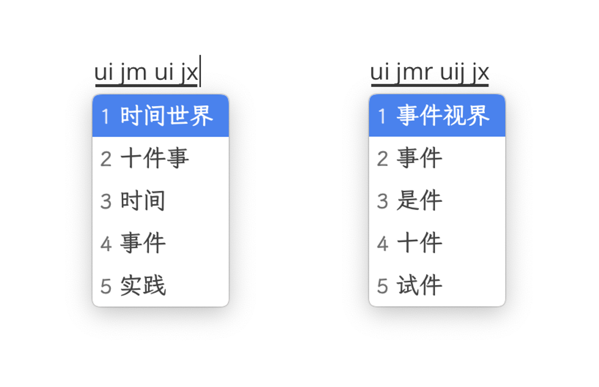
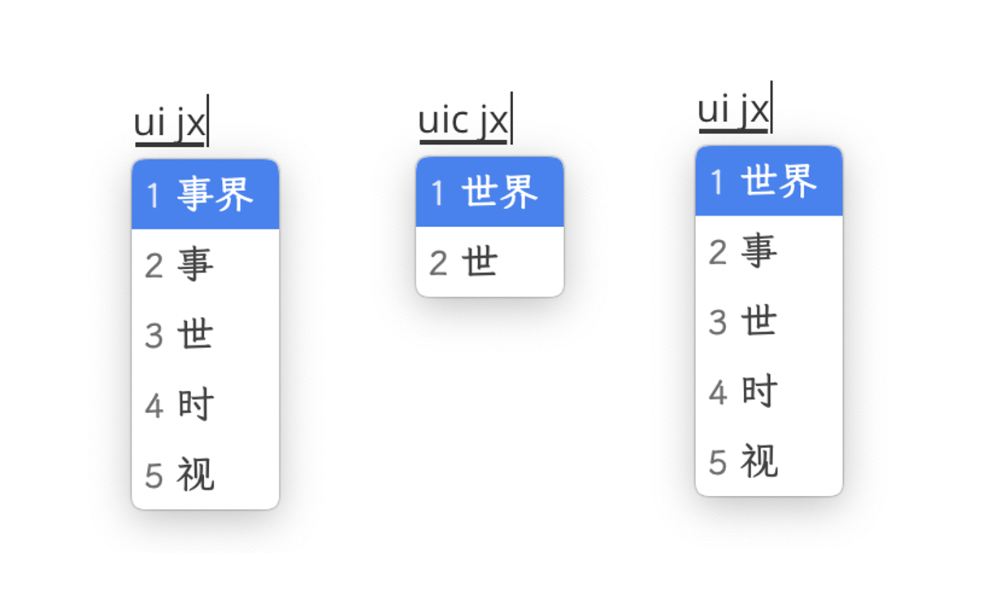

+++
title = "Rime 双拼折腾记"
date = 2023-06-01T17:07:59+08:00
updated = 2023-12-26T22:06:16+08:00
[taxonomies]
tags = ["ime", "rime", "double_pinyin"]
[extra]
headline = "我能联用两种翻译器而不伤身体"
math = true
comment = true
+++

从去年 6 月（重新）学习形码开始，我就误打误撞进入了深不可测的中文输入法世界。在我熟悉了各种输入法方案之后，也开始亲自折腾输入方案了。而这一过程中令我惊喜的是，Rime 不仅完全可以实现我的「智能双拼辅助码整句输入」的设想，而且成本相当之低。为了能进一步传 Rime 教，也为了宣传我的双拼辅助码整句设想，在这篇博客里我将比较具体地介绍我是如何用 Rime 实现我的输入法方案的，并介绍实现中的一些难题及其解决方法。

<!-- more -->

## 双拼辅助码整句输入

双拼是一种高效的音码输入方案，每个拼音（不带声调）均使用两个字母表示，第一个字母表示声母，第二个字母表示韵母（含介音），第一个字母和第二个字母到拼音的映射不同。例如，自然码双拼方案中，字母 U（作为第一个字母时）代表 sh，字母 D（作为第二个字母时）代表 uang，因此双拼序列 UD 就可以表示拼音音节 shuang，双拼 UU 表示 shu（而不是没有意义的 shsh）。双拼可以使用两个字母把所有普通话音节表示出来，相比全拼，可以降低不少码长。

然而，纯音码有一个本质缺陷：汉字同音字实在是太多了。即便可以把一个较长的拼音压缩成两个字母，也不能减少重码。因此，部分输入方案引入了形码作为筛选重码的手段。自然码是这类方案中推出较早的。自然码中，每个字除了两个音码字母（双拼）外，还有两个形码字母作为辅助码，第一个形码表示这个字的部首，第二个形码则是这个字去除掉部首的部分 [^1]。以「码」为例，码的双拼是 MA，部首是「石」（U），去掉部首是「马」（M），因此「码」的全码是 MAUM。原本「码」的同音字有「吗麻骂马」等等，但添加了字形信息后，重码就大大减少了。这类方案往往被俗称为「双拼加形」。

遗憾的是，目前对双拼加形方案的实现或多或少都有些小问题。

**1、码表输入**：将字词等编码为码表（每个字词编码的最大长度是固定的），用类似五笔的查表方式输入。典型的例子有小鹤音形和自然码（码表输入方式）。自然码和小鹤音形最大码长均为 4。由于码表最大长度是固定的，因此编码空间相当有限。四码 26 字母的编码空间无非是 \\(26^1 + 26^2 + 26^3 + 26^4 = 475254\\) ，而汉字读音的分布本身又不太均匀，字和词的编码空间又没有分开，因此只能使用小词库。但此类方案的优势是 (1) 对输入法的要求低，可以随意挂到任何五笔输入法上；(2) 精确度高，熟练后可以不开候选窗盲打。

**2、字词辅助输入**：例子有（后期）自然码、落格输入法、手心输入法等。这类输入法把辅助码作为输入法的一个真正的成员看待，可以使用辅助码进行动态筛选、造词等。然而，这类输入法常常仿效自然码的做法，只能在词尾添加辅助码筛选。例如，「它们」的双拼码是 TAMF，要排除掉「他们」「她们」可以添加一个辅助码，但添加的位置在词尾 TAMF**b**。这种做法的好处是逐词输入的时候可以避免跳回前一个字末加辅助码，然而缺点也很明显：(1) 如果要一次输入多个词的时候，就只能筛选末尾的词；(2) 辅助码只能输入两码，在词里字数较多的时候可能不够用。但这类方案完全兼容智能拼音的整句打法，相比第一种来说易学性提高了许多。

**3、智能拼音输入法挂接**：尽管上一类输入法具有相当的优势，但要求输入法本身对双拼辅助码有特殊的支持。但以搜狗为代表的智能拼音输入法目前已经有相当的精准度，只需把第一类码表「挂接」上去（导入为自定义短语），就可以精准地输入单字和部分常用词了，而且整句输入不受影响。但是很显然，一旦进入了整句模式，就再也无法使用辅助码了。

上面这三种输入方式都具有一定的确定性：一部分编码具有 100% 唯一的映射。例如，「d 空格」打出来的字永远是「的」。确定性的编码在熟练之后，可以减轻大脑的输入负担并提高输入速度。

几个月前，我开始制作适用于传承字的音形码方案。在这一过程中，受到上述挂接用法的启发，我开始思考是否可以实现「支持整句的双拼+辅助码」的输入方法。这种输入方法与双拼整句输入类似，但是允许在任意字后面添加辅助码，协助拼音引擎选字。例如，「世界」和「视界」这两个词读音上根本没有区别，但是意义有很大的不同，假如我们可以在输入的过程中直接添加辅助码[^2]：



我使用 [Rime](https://rime.im/) 初步尝试了这个想法。令我惊喜的是，这不仅是[可以实现的](https://github.com/ksqsf/rime-moran/)，而且实现的成本并不高！

下面，我将详细介绍如何实现这个这个想法：

1. 使用 script 翻译器实现不换档[^3]的、带辅助码的双拼整句输入；
2. 使用 table 翻译器实现简码和简词输入；
3. 使用 Lua 插件解决 table 翻译器和 script 翻译器的冲突从而使得可以正常造词。

除了上述问题外，我还解决了部分其他问题，但限于篇幅，本文不再介绍这些问题和解决方法。

## 整句辅助输入：Script 翻译器

Rime 支持拼音输入。但可能不为许多人所知的是，Rime 使用一种相当通用的算法支持了拼音输入，并没有对拼音进行特殊支持。这里核心想法是：**假如把双拼加形编码视作一种拼音，那么就可以让 Rime 引擎自动地支持带辅助码的整句输入了**。

我们将制作一个叫做 lizi （例子）的 Rime 输入方案。

### 带辅助码的单字全码码表

佛振在 2013 年于 Rime 贴吧介绍了[一种辅助码的做法](https://tieba.baidu.com/p/2094178562)，基本思想是给每个字的音码编码后加上形码辅助码，因此，这里我们使用完全相同的方法制作单字辅助码全码码表。

```yaml
# 文件：lizi.dict.yaml
# encoding: utf-8
---
name: lizi
version: "1"
sort: by_weight
use_preset_vocabulary: false
...
时	ui;oc	999000
间	jm;mo	999000
世	ui;cv	999000
界	jx;tj	999000
事	ui;aa	999000
件	jm;rn	990000
视	ui;ju	990000
```

然后仿照朙月拼音等方案，编写一个基本的拼音方案。

```yaml
# 文件：lizi.schema.yaml
# encoding: utf-8
schema:
  schema_id: lizi
  name: 例子
  version: "0.1"
  description:

switches:
  - name: ascii_mode
    reset: 0
    states: [ 中文, 西文 ]
  - name: full_shape
    states: [ 半角, 全角 ]
  - name: simplification
    reset: 1
    states: [ 漢字, 汉字 ]
  - name: ascii_punct
    states: [ 。，, ．， ]

engine:
  processors:
    - ascii_composer
    - recognizer
    - key_binder
    - speller
    - punctuator
    - selector
    - navigator
    - express_editor
  segmentors:
    - ascii_segmentor
    - matcher
    - abc_segmentor
    - punct_segmentor
    - fallback_segmentor
  translators:
    - punct_translator
    - script_translator
  filters:
    - simplifier
    - uniquifier

speller:
  alphabet: abcdefghijklmnopqrstuvwxyz;
  delimiter: " '"

translator:
  dictionary: lizi
```

部署后选择「例子」方案，输入 u 或 j 等编码就可看到候选项了。

### 拼写运算

我们已经实现了一个带辅助码的 Rime 双拼方案，但是在尝试后很快就会发现 Rime 无法支持简略拼写（即输入 uijm 时，Rime 并不能自动切分成 ui jm 两个音节并分别进行转换）。此外，目前的方案仍然需要使用 ; 引导辅助码。为了解决这两个问题，我们使用[拼写运算（spelling algebra）](https://github.com/rime/home/wiki/SpellingAlgebra)给每个字都产生真正的编码。

具体来说，我们希望一个字的实际输入编码是 yyxx（音音形形），并且用 y, yy, yyx, yyxx 都可以打出这个字。为此，将上面的 `speller` 一节可以作如下修改：

```yaml
# lizi.schema.yaml
speller:
  alphabet: abcdefghijklmnopqrstuvwxyz  # 可以删掉 ; 了
  delimiter: " '"
  algebra:
    - derive/^(\w*);(\w)(\w)$/$1$2$3/
    - derive/^(\w*);(\w)(\w)$/$1$2/
    - derive/^(\w*);(\w)(\w)$/$1/
```

官方文档说得很拗口，但实际上拼写运算做的事情很单纯，就是从已有的编码算出一个新编码。以 ui;oc 为例，第二条规则可以匹配之，然后产生一个新的编码 uio（第1个匹配组是 ui，第2个是 o，第3个是 c）。因此，用户输入 uio 时就可以找到「时」这个字了。

通过拼写运算，我们实现了简拼，并不再需要输入 `;` 了。到目前为止，事实上支持辅助码的双拼整句输入法已经制作完成了。是的，就是这么简单。

### 智能组词

把双拼加辅码视作拼音音节的好处是 Rime 可以自动实现智能造词，这是拼音输入法本身的特性（Rime 实现并提供的），我们并不需要做任何其他适配。

例如，使用上述方案输入「ui jx」（对应的拼音是 shi jie），首选是「事界」（我们目前还没有任何词库，Rime 并不知道最佳选项是「世界」）。但是，当我们输入「uic jx」时，Rime 就会自动产生「世界」这个词，上屏后，Rime 就会造出这个词，在未来使用输入「ui jx」时也可以打出这个词了。



## 简码与简词：Table 翻译器

使用 script 实现带辅助码的双拼整句输入已经是一个不错的结果了，但我们的要求一般更高。和拼音输入法一样，这种输入方式具有**前缀单调性**。这个词是我自创的，用于描述这样的现象：「的」的字频非常高，因此输入「d」时已经知道是「的」了，但是此时继续打全「de」，它必然一定还是「的」字。（更确切地说：一个全码 XY 的真前缀 X 不视作另外的编码，X 映射到的字一定与这个 XY 映射到的字相同。这样用户在输入 X 时看到了这个字 C，继续打 C 后续的编码，C 不会变成另一个字，因此我称之为某种「单调性」。）

但这实际上是对编码空间的浪费。原本 d 和 de 可以映射到两个不同的字（视作两个编码，比如 d 可以映射到「的」，而 de 可以映射到「得」），现在既然 d 不是一个独立的编码，那么 d 和 de 就一定是相同的字。

除了浪费编码空间之外，这种单调性还损害了打字的确定性。由于编码的真前缀本身不是编码，所以它会受到用字频率的影响。可能读者偶尔会发现，d 的首选居然可以不是「的」而是另一个字。

因此，我们希望可以打破这种单调性。这并不是一个新想法，形码的简码就是这样的。简码的实质是手动指定一些全码前缀的映射，从而增大编码空间，减少重码。

为了在 Rime 中能固定编码的映射，我们需要借助 Table 翻译器的能力。引入一个新的词典：

```yaml
# guding.dict.yaml
# encoding: utf-8
---
name: guding
version: "1"
sort: original
...

时	u
间	j
世	uic
界	jx
事	ui
件	jm
视	uij
为什么	w
```

「固定」词典把一些编码的映射固定下来。这里随便指定了一些映射。

为了能在 lizi 方案中引用这个词典，需要让 Rime 知道这个词典的存在，并构建这个词典。方法是创建一个 dummy 方案。

```yaml
# guding.schema.yaml
schema:
  schema_id: guding
  name: 工具方案-勿用
translator:
  dictionary: guding
  enable_user_dict: false
```

然后把这个方案添加到 lizi 的依赖中：

```yaml
# lizi.schema.yaml
schema:
  schema_id: lizi
  name: 例子
  version: "0.1"
  description:
  dependencies:
    - guding
```

最后，我们添加一个 table 翻译器。table 翻译器用于实现五笔等形码输入法，它的工作原理非常简单：直接查表，查到就输出，非常适合简码输入的情形。

```yaml
# lizi.schema.yaml
engine:
  # ...
  translators:
    - punct_translator
    - reverse_lookup_translator
    - table_translator@guding    # 新增
    - script_translator
  # ...

guding:
  dictionary: guding
  initial_quality: 5
  enable_user_dict: false
  enable_sentence: false
  enable_encoder: false
  encode_commit_history: false
```

这里的 `initial_quality` 可以填一个较大的数字，使得 table 的输出先于 script 翻译器出现。此外，table\_translator 应在 script\_translator 之前出现：用户输入是依次经过各 translator 的，我们希望 table 翻译器先处理输入，如果 table 中没查到，再进入 script 翻译器。

到这里，我们就已经完成了方案的所有主要设计。

## 造词：顶层翻译器

虽然方案的主体已经完成了，但是引入 table 翻译器后，造词机能会有较大的问题。

假设我们要造词「世间」，输入 ui jm（为了说明问题，这里不用辅助码），然后手动选择「世」字，再选择「间」字。按理来说，我们期望输入法可以造出「世间」这个词。然而不论你如何尝试，使用这种方式输入，这个词都造不出来！

这是因为当我们选择了「世」字后，输入状态只剩下了 jm，而 jm 会进入 table 翻译器，所以「间」字是 table 翻译器输出的。script 翻译器根本看不到我们输入了「间」字，当然也无法造出「世间」这个词了。

这个问题的彻底解决可能比较复杂，目前我采用的解决办法是：当用户已经选择了部分字后，就临时禁用掉 table 翻译器。

虽然听起来简单，但是 librime 并不能直接实现这个想法。这里我通过 librime 的 Lua 插件支持写了一个自定义的顶层翻译器实现了这个想法。顶层翻译器根据当前状态依次调用 table 和 script 翻译器。根据[文档](https://github.com/hchunhui/librime-lua/wiki/Scripting)，使用 `Component` 实现该功能。

```lua
-- lua/top_translator.lua
local top = {}
local fixed = nil
local smart = nil

function top.init(env)
   -- 创建 translator 组件，供后续调用
   fixed = Component.Translator(env.engine, "", "table_translator@guding")
   smart = Component.Translator(env.engine, "", "script_translator@zhengju")
end

function top.fini(env)
end

function top.func(input, seg, env)
   if (env.engine.context.input == input) then
      local fixed_res = fixed:query(input, seg)
      for cand in fixed_res:iter() do
         yield(cand)
      end
   end

   local smart_res = smart:query(input, seg)
   for cand in smart_res:iter() do
      yield(cand)
   end
end

return top
```

其中 `(env.engine.context.input == input)` 判断用户是否已经选过字。然后将这个翻译器接入方案中：

```yaml
# lizi.schema.yaml
engine:
  # ...
  translators:
    - punct_translator
    - reverse_lookup_translator
    - lua_translator@*top_translator
    # 删掉之前写的 table_translator 和 script_translator
  # ...

# 之前的 translator: 改名成 zhengju:，和 top_translator.lua 中的引用保持一致
zhengju:
  dictionary: lizi
  prism: lizi

guding:
  dictionary: guding
  initial_quality: 5
  enable_user_dict: false
  enable_sentence: false
  enable_encoder: false
  encode_commit_history: false
```

## 其他问题和更多想法

尽管我们使用少量的代码就实现了一个相当复杂的双拼辅助码整句输入法，但实用中，还有不少小问题。有一部分问题我已经有了初步的解决方案，另一部分仍在探索。

- 字词重码问题。「半」字的全码是 bjbf，与「版本」重码。如何将这两者分开？
- 字频和词频问题。我们是完全从头制作的字词词库，不能使用八股文词库中的读音和字频、词频信息。
- 多音字和容错码问题。假设一个字有 \\(n\\) 个读音，有 \\(m\\) 种辅助码（其中一种是正确的编码，其他 \\(m-1\\) 种是容错码），那么这个字将一共有 \\(nm\\) 个编码。如果某个词有多个这样的字，那么这个词的编码会特别多。

此外，在了解了 Lua 插件的能力之后，我认为实际上在 Rime 中是可以实现真正的「智能辅助码」的，也就是不把辅助码直接附在音码之后写在词典里，而是在运行时动态查询、进行筛选。这需要手动写一个新的翻译器，工程量未知，但我觉得很值得一试。

<aside>
<p>该想法目前已被实现！<a href="https://github.com/HowcanoeWang/rime-lua-aux-code/">rime-lua-aux-code</a> 通过 <code>lua-filter</code> 实现了动态间接辅助码。我另行实现了<a href="https://github.com/ksqsf/rime-moran/blob/4a927132f7968be0ce3c3282540c148b9645834a/lua/moran_aux_translator.lua">动态直接辅助码</a>。</p>
</aside>

## 结语

这篇文章比较详细地描述了「[魔改自然码](https://github.com/ksqsf/rime-moran/)」方案的核心设计和实现。据我所知，魔然是第一种支持整句输入的双拼+辅助码方案。它能实现出来，离不开 Rime 打下的良好基础。我希望这篇文章 (1) 可以鼓励有想法的 Rime 用户参与到方案设计中来，(2) 可以鼓励有想法的方案设计者来尝试 Rime，(3) 提供的解决方案可以帮助到有类似问题的人。

---

[^1]: 一般情况下去掉部首后会是一个完整的、可识读的字。有的时候，去掉的部分不成字，或比较生僻，自然码会取位于末尾、尽可能大的成字部件。

[^2]: 这种方法会使得辅助码被附加在「字」的后面，而不是「词」的后面，对某些人来说可能不如「字词辅助输入」方式。然而，此种方式可以加强对单字编码的印象，从而在未来单字输入或组新词时更有优势。

[^3]: 不需要输入任何其他字符进入某种「辅助码输入状态」，而是直接敲辅助码字母即可。例如，「码」字可直接输入「MAUM」，而不需要在 MA 后按 Tab 或 ; 等非字母键。
