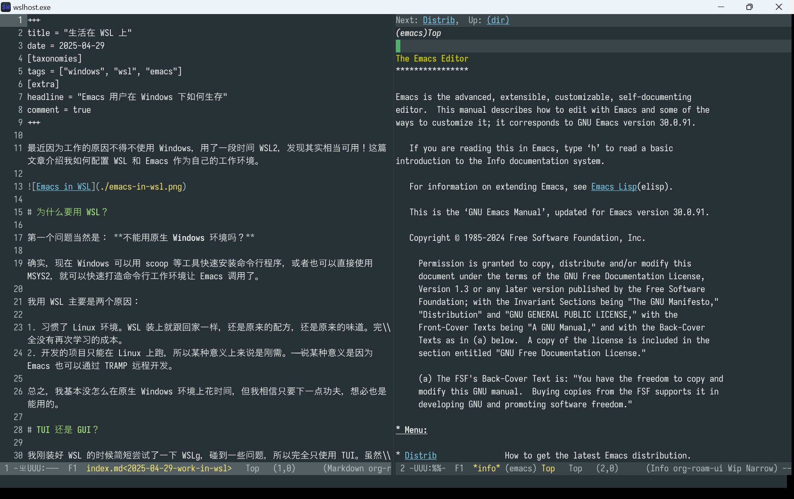
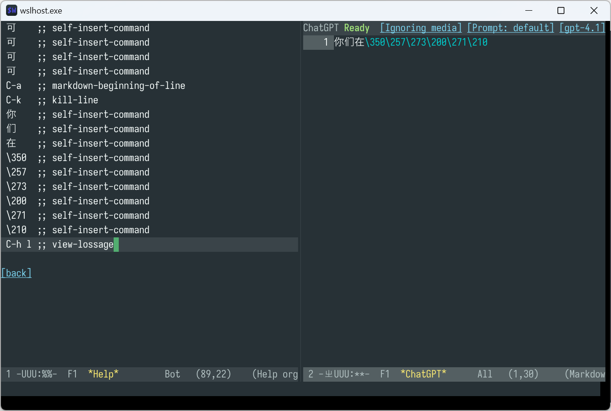

+++
title = "生活在 WSL 上"
date = 2025-04-29
[taxonomies]
tags = ["windows", "wsl", "emacs"]
[extra]
headline = "Emacs 用户在 Windows 下如何生存"
comment = true
+++

最近因为工作的原因不得不使用 Windows，用了一段时间 WSL2，发现其实相当可用！这篇文章介绍我如何配置 WSL 和 Emacs 作为自己的工作环境。



# 为什么要用 WSL？

第一个问题当然是： **不能用原生 Windows 环境吗？**

确实，现在 Windows 可以用 scoop 等工具快速安装命令行程序，或者也可以直接使用 MSYS2，就可以快速打造命令行工作环境让 Emacs 调用了。

我用 WSL 主要是两个原因：

1. 习惯了 Linux 环境。WSL 装上就跟回家一样，还是原来的配方，还是原来的味道。完全没有再次学习的成本。
2. 开发的项目只能在 Linux 上跑，所以某种意义上来说是刚需。——说某种意义是因为 Emacs 也可以通过 TRAMP 远程开发。

总之，我基本没怎么在原生 Windows 环境上花时间，但我相信只要下一点功夫，想必也是能用的。

# TUI 还是 GUI？

我刚装好 WSL 的时候简短尝试了一下 WSLg，碰到一些问题，所以完全只使用 TUI。虽然起初只是妥协，但后来发现 TUI 完全够用。当然，用 TUI 就与一些功能无缘了：

1. TUI 里只能使用一种字体。
2. TUI 的 Emacs 里无法显示图片。
3. Emacs 30 以前没有 tty child frame。

但除此之外，好像也没有什么短板。

# 使用什么终端？

如上图所示，我使用 WezTerm。其实一开始我也是和所有人一样从 Windows Terminal 开始的，但很快就发现 Emacs 在 Windows Terminal 中会有「画面撕裂」的问题，而 WezTerm 没有。

我对 WezTerm 的配置比较简单，不过值得一提的是 Emacs 在终端下 **无法接收到一些按键** ，如 `C-TAB`，但我们可以在 WezTerm 里把这个键绑定为「发送字符串到终端程序」，从而曲线救国：

```lua
return {
   keys = {
      -- 按 C-TAB 发送 C-x t o 到终端程序里
      { key = 'Tab', mods = 'CTRL', action = act.SendString('\x18\x74\x6f') },
   }
}
```

至于这个字符串怎么获得，可以在 ielm 里调用 `kbd`：

```lisp
ELISP> (kbd "C-x t o")
"^Xto"
ELISP> ?^X
ELISP> ?^X
24
 (#o30, #x18, ?\C-x)
```

这样你就知道了 `Ctrl-x` 其实对应于一个 ASCII 码为 0x18 的字符，从而构造出 `SendString` 的参数。

<aside>
在 Emacs 中，这里的 <code>^X</code> 会带有颜色，与正常文本区分开来，表示它是一个完整的特殊字符。请不要尝试直接从网页上复制 <code>^X</code>，这里为了可以在浏览器里显示出来，将它拆为了两个字符 <code>^</code> 和 <code>X</code>。
</aside>

# WSL 配置

WSL 有两层配置系统：

1. Windows 那边的 `C:\Users\USERNAME\.wslconfig` 用来配置虚拟机启动的选项。
2. Linux 里的 `/etc/wsl.conf` 用来配置系统启动和 Linux 服务等。

下面我们会省略掉完整路径，只写文件名，如 `.wslconfig`。[官方文档](https://learn.microsoft.com/en-us/windows/wsl/wsl-config)。

## 用什么发行版？

出于习惯，我自己用的是 Debian。

但我碰到了一些 WSL Debian 带来的问题（如无法启动 .exe，具体怎么配置下面会提到）。这些问题 **可能** 在 Ubuntu 里不存在（因为微软主打的就是 Ubuntu，所以如此猜想）。

如果要选，我建议是选一个自己比较懂的。如果懒得折腾，直接用 Ubuntu 也无妨。

## 分配更多硬件资源

在 `.wslconfig` 里设置：

```conf
processors=12
memory=12GB
```

## 开启 systemd

编辑 `/etc/wsl.conf`：

```conf
[boot]
systemd = true
```

## 直接运行 .exe

Debian 的 WSLInterop 似乎与 systemd 有点兼容性问题，需要手动修复：

<script src="https://gist.github.com/ksqsf/477ee4705e4e51f4bc2de01adb5f7c1d.js"></script>

## 配置 Docker

开启 systemd 后直接安装 Docker 包即可。

## 配置 Qemu

WSL2 支持运行 KVM 虚拟机。编辑 `.wslconfig`：

```conf
nestedVirtualization=true
```

编辑 `/etc/wsl.conf`：

```conf
[boot]
command = /bin/bash -c 'chown -v root:kvm /dev/kvm && chmod 600 /dev/kvm'
```

# Emacs 配置

## 判断自己是不是在 WSL 里

```lisp
(string-match "WSL2" operating-system-release)
```

这个表达式在 WSL 中求值为非 nil 值。

## 使用鼠标

开启 `xterm-mouse-mode`：

```lisp
(when (not (display-graphic-p))
  (xterm-mouse-mode +1))
```

TUI Emacs 支持用鼠标缩放界面、点击菜单、打开右键菜单（context menu）、选择文本等操作，基本上你在 GUI 里怎么用，在 TUI 里就能怎么用！

## 剪切板集成

剪切板集成可能是最重要的配置。首先我们引入一些命令：

```lisp
(defun wsl-copy (beg end)
  "In a WSL2 environment, copy region to the system clipboard."
  (interactive "r")
  (let ((default-directory "/"))
    (shell-command-on-region beg end "clip.exe" " *wsl-copy*"))
  (deactivate-mark))

(defun wsl-get-clipboard ()
  "In a WSL2 environment, get the clipboard text."
  (let ((clipboard
         (let ((default-directory "/"))
           (shell-command-to-string "powershell.exe -command 'Get-Clipboard' 2>/dev/null"))))
    (setq clipboard (replace-regexp-in-string "\r" "" clipboard))
    (setq clipboard (substring clipboard 0 -1))
    clipboard))

(defun wsl-paste ()
  "In a WSL2 environment, paste the text from the system clipboard."
  (interactive)
  (if (derived-mode-p 'vterm-mode)
      (vterm-insert (wsl-get-clipboard))
    (insert (wsl-get-clipboard))))
```

这里提供了两个命令，`wsl-copy` 和 `wsl-paste`，作用也顾名思义。还能不能进一步集成呢？可以：

```lisp
(when (string-match "WSL2" operating-system-release)
  (advice-add 'gui-select-text :before
              (lambda (text)
                (when select-enable-clipboard
                  (with-temp-buffer
                    (insert text)
                    (wsl-copy (point-min) (point-max)))))))
```

这样，在按 M-w 的时候，就会自动更新 Windows 的系统剪切板了。遗憾的是这只是单向同步，我暂时没有想到如何让 Emacs 与 Windows 双向同步。

## 直接从 Windows「打开文件」

建议安装一个叫做 [`wslu`](https://wslu.wedotstud.io/wslu/) 的工具集。里面有一个叫 `wslview` 的命令，可以用 Windows 侧的默认程序打开路径/URI。

有这个命令后，就可以用到各种地方了。如 dired 里：

```lisp
(setq dired-guess-shell-alist-user
        '(("\\.pdf\\'" "wslview")
          ("\\.png\\'" "wslview")
          ("\\.jpg\\'" "wslview")))
```

（不过实际上 `xdg-open` 好像也能用……）

还有一个很实用的命令是直接打开当前目录：

```lisp
(defun open-directory-here ()
  "Open the current directory in the GUI file manager.

In most cases, this means the current directory of the current buffer."
  (interactive)
  (shell-command (format "%s %s" "wslview" (shell-quote-argument (expand-file-name default-directory)))))
(global-set-key (kbd "C-c d") #'open-directory-here)
```

GUI 下 dired 是支持拖放文件的，但在 WSL 里就不行了。用这个命令可以稍微解决一下这个问题。

## browse-url

Emacs 里 `browse-url` 可以用系统默认浏览器打开 URL。但默认情况下并不能支持直接打开 Windows 那边的默认浏览器。一番探查后发现，是因为 `browse-url` 会觉得当前系统是 Linux，但又没有 GUI，所以会罢工。这里直接强行设置一个 `DISPLAY` 环境变量就可以了：

```lisp
(when is-wsl
  (setenv "DISPLAY" ":0"))
```

## 中文输入法

理论上，Windows Terminal 和 WezTerm 都可以直接用 Windows 输入法打字。但实际上我碰到了一个奇怪的问题：如果打字速度比较快，汉字就容易丢失一个字节，导致 Emacs 无法识别。如下图所示：



这个问题在 Windows Terminal 上也可以复现。由于 WSL 架构复杂，暂时不清楚到底是谁的锅：Windows PTY 的？Emacs 的？WSL 的？还是终端模拟器的？

所以为了能舒舒服服地打字，建议配置使用 [emacs-rime](https://github.com/DogLooksGood/emacs-rime)。至于 Rime 怎么配置使用，这里就不赘述了。不过有一点需要注意，在 isearch 里是不能用 emacs-rime 的，因为 isearch 根本不使用 minibuffer。使用 [isearch-mb](https://elpa.gnu.org/packages/isearch-mb.html) 可修复该问题。

## LaTeX & SyncTeX

LaTeX 编译器可以直接在 Linux 里安装 texlive。阅读就直接用 Windows 那边的 PDF 阅读器：

```lisp
(setq TeX-view-program-selection '((output-pdf "wslview")))
(setq TeX-view-program-list '(("wslview" ("wslview '%o'"))))
```

并且还可以直接让 PDF 阅读器根据 SyncTeX 信息跳转到源代码！以 SumatraPDF 为例，在 Settings -> Options -> Set inverse search command-line 中，输入如下命令：

```shell
wsl emacsclient -n +%l:%c "$(wslpath '%f')"
```

这里 `l` `c` `f` 分别是行号、列号和文件路径。其中 `wslpath` 把 Windows 式的文件名转换为 WSL 里可直接用的文件名。

## Boot into Emacs

我在 `~/.profile` 末尾添加了：

```shell
exec emacs
```

这样，只要一打开 WSL 就会自动启动到 Emacs 里。几乎很难发现它和独立的 Emacs 有什么区别。

## 用 WSL Emacs 的另一个理由

我的确也安装了原生 Windows 版 Emacs，但离奇的是，我的配置启动居然要 18 秒之久！相比之下，WSL TUI Emacs 只需要 1.3 秒。

# 终

值得一提的暂时只能想起来这些。

总的来说 WSL 的体验不错。最近的工作一直在用 WSL，没碰到过什么难以克服的问题。
