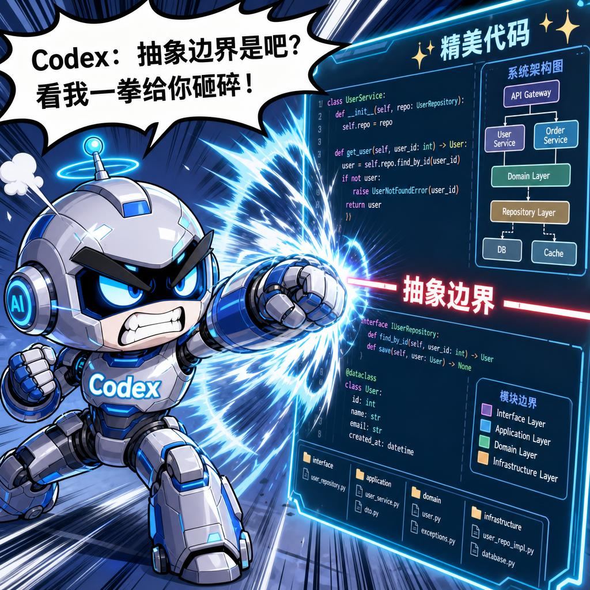
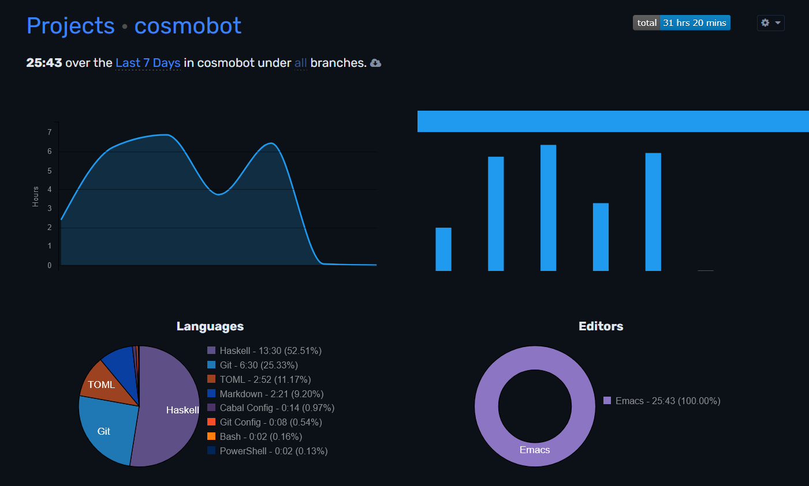

+++
title = "24 Hours of AI Coding"
date = 2026-05-14
[taxonomies]
tags = ["ai", "haskell", "experience"]
[extra]
headline = "To vibe or not to vibe? That is the question."
math = false
comment = true
+++

> Disclaimer: This post was translated into English by an AI model. It may contain mistakes or awkward wording.

Whether from news hype, friends in the AI industry, or online discussions, everyone keeps proclaiming the importance of the AI era. Yet I had never taken it very seriously. Claude Code has been out for more than a year, and I had occasionally used self-paid APIs to write small programs or analyze unfamiliar repositories, but I had never used an AI coding tool for a truly serious project. Yes, LLMs can write code, but did we not already know that? Only recently, after seeing friends use coding agents to build some quite interesting things, did I seriously try AI coding for the first time. The experience was perhaps too successful for me, even shocking. While the memory is still fresh, I want to record my first AI coding project.

<!--more-->

## A Small Project, Cosmobot, and the Initial Handwritten Stage

I have many ideas I want to try, but often cannot turn them into executable code quickly enough. Recently, because another project chose Haskell, I was considering picking Haskell back up as my "native language of thought" and trying to master it. Since AI is popular, I decided to make an AI agent for practice. Its name is [Cosmobot](https://github.com/ksqsf/cosmobot).

My expectations for this AI agent were not high. It was only a practice project, so I deliberately chose a fancier stack I had not used before. The two core components were:

* [Effectful](https://haskell-effectful.github.io/): a high-performance effect system for structuring the whole system.
* [Streaming](https://hackage.haskell.org/package/streaming): a streaming data library for modeling message streams from different platforms, streaming LLM output, message chunking, and so on.

Effectful, or [effect systems](https://okmij.org/ftp/Haskell/extensible/exteff.pdf) in general, lets us divide a system's side effects into different effects and combine multiple effects. An effect expresses a specific capability, such as a `Log` effect for logging or an `LLM` effect for calling an LLM. Functions must explicitly mark the effects they may produce:

```haskell
mayLog     :: (Log :> es) => Eff es ()
mayCallLLM :: (LLM :> es) => Eff es ()
```

Neither `mayLog` nor `mayCallLLM` directly invokes the corresponding capability. Instead, loosely speaking, it sends an effect request, which is intercepted by an effect interpreter; only then does the real action occur. In effect-system projects, `main` often contains a long chain of `runSomeEffect` calls:

```haskell
main = runEff $
  runLog .
  runLLM .
  runDatabase .
  runFile $ do
    actualCode
```

Streaming provides stream processing. My reason for using it was simple: a "message stream" should be a stream. Streams from different sources should be mergeable and then processed uniformly:

```haskell
incomingMessagesTelegram :: (Telegram :> es, HTTP :> es) => Stream (Of TelegramMessage) (Eff es) ()
incomingMessagesQQ       :: (QQ :> es, HTTP :> es)       => Stream (Of QQMessage)       (Eff es) ()
incomingMessages = incomingMessagesTelegram <> incomingMessagesQQ
```

With this idea, I implemented a `Telegram` effect that converted `getUpdates` into an update stream, and `main` repeatedly printed updates. Then the project was shelved.

## First Six Hours: First Contact with Vibe Coding

This month, coincidentally, ChatGPT gave away a free month of Plus, including some Codex quota. After seeing friends build fun things with vibe coding, I wanted to try it too.

Last Saturday I used the Cosmobot project as the test subject. I wrote a simple `AGENTS.md`:

```markdown
You are a super proficient professional Haskell hacker. You value correctness, conciseness, and above all, performance and robustness of a software system. You have superb taste and you hate messy code. You are a fan of algebraic domain design. 

cosmobot is a unified chatbot framework. It is an industrial-grade codebase, but yet is simple enough to be read and modified by humans.

You are granted some autonomy to organize the codebase as you wish.

- Use `effectful` for managing the whole application.
- Use `streaming` for managing incoming messages.
```

My first use of AI coding surprised me. Codex performed extremely well on this project. It could always complete the requested tasks smoothly, with high efficiency and apparently good quality.

* It one-shotted QQ support, which left a deep impression. It seemed thoroughly familiar with the OneBot API and implemented it in Haskell with ease.
* I initially used dotenv for configuration for simplicity. When I asked it to migrate to TOML, it also one-shotted the change.
* With only a handful of interactions, the project reached the point where Telegram and QQ were both integrated into a unified message pipeline.

Up to this point, I had barely read the code. I just kept asking Codex to add features, and Codex kept finishing them quickly. What surprised me more was that Codex's implementation had no obvious problems. I did not need to read the code: compile, run, and the behavior was what I wanted. This fast feedback loop was addictive, so much so that I forgot to commit progress. In the end, I only remembered to commit after the full agent tool-calling implementation was already finished. The ancient hand-written code was not preserved in Git, which is somewhat regrettable.

After the five-hour quota ran out, I could not stop, so I bought forty dollars of credit and continued for several more hours. In fact, by the first six hours, I had almost completed my original idea for the project: Telegram and QQ support, tool calls, image generation and sending, message parsing and storage, simple permission management, and command routing. There was even a SauceNAO image-search command, also implemented by Codex; I only provided an API key.

## Middle Six Hours: Features and More Features

Next I kept adding features: todo lists, streaming LLM output, a state-management framework, memory, web tools, memory tools, bash tools, and more. At this point, quota became my biggest limitation, and I shamefully subscribed to Pro Lite. The repository had grown to an astonishing ten thousand lines of code. Completing so many features in so little time felt unbelievable.


## Later Six Hours: Shit-mountain-ification and the Hard Work of Shoveling

At this point, the whole system still largely followed my original architecture. The AI had only kept adding code and implementing features, without considering module decomposition. Of course, I had not asked it to decompose modules either. So I decided to clean up the code.

It would have been fine if I had not started cleaning. But as soon as I opened the code, I saw a very clear tendency toward shit-mountain-ification:

**Duplicated code that should not be duplicated**

* It often avoided existing libraries or services and hand-wrote implementations instead.
* Dispatching platform-specific behavior by message platform tags was done with direct pattern matching, without abstraction into type classes or vtables.
* And so on.

**Coupled code that should not be coupled**

* The `Main` module contained code for merging concurrent streams.
* The LLM module contained HTTP code.
* The Agent module contained many tools.
* Conversation data structures and conversation logic were mixed together.
* All SQLite state was concentrated in one module.
* And so on.

Codex also tended to modify code in place rather than think about whether a better abstraction existed. For example, the original agent loop looked like this, and it was not too bad:

```haskell
runAgent
  :: (LLM.LLM :> es, Log :> es)
  => Int
  -> AgentContext es
  -> [Tool es]
  -> Conversation
  -> Eff es (Text, Conversation)
runAgent maxTurns context tools conversation =
  loop (max 1 maxTurns) (closeInterruptedToolCalls conversation)
  where
    exposedTools = filter (`toolAllowed` context) tools

    loop turnsLeft current = do
      answer <- LLM.askWithTools (map toolSchema exposedTools) current.messages
      let answered = appendMessage (LLM.assistantAnswer answer) current
      case answer.toolCalls of
        [] ->
          pure (answer.content, answered)
        calls
          | turnsLeft <= 1 -> do
              logInfo "Agent tool turn limit reached" calls
              let paused = appendMessages (map pausedToolResult calls) answered
              pure (toolLimitMessage answer.content calls, paused)
          | otherwise -> do
              results <- traverse execute calls
              let next = appendMessages (map fst results) answered
              traverse_ (\messageId -> context.remember messageId next) (concatMap snd results)
              loop (turnsLeft - 1) next

    execute call = do
      let callName = call.name
      result <- runTool context tools call `catch` \(err :: SomeException) ->
        pure (toolText [i|Tool #{callName} failed: #{show err :: String}|])
      pure (LLM.toolResult call result.content, result.messageIds)
```

Then, in one later change, Codex turned this originally not-too-awful function into a rather awful implementation: it shoved web-fetch state directly into the algorithm core. Worse, I noticed this quite late, because it happened during the frantic feature-building phase when I was not reading code much.

```haskell
runAgent
  :: (LLM.LLM :> es, Log :> es)
  => Int
  -> AgentContext es
  -> [Tool es]
  -> Conversation
  -> Eff es (Text, Conversation)
runAgent maxTurns context tools conversation =
  loop (max 1 maxTurns) 0 (closeInterruptedToolCalls conversation)
  where
    exposedTools = filter (`toolAllowed` context) tools

    loop turnsLeft webFetchUses current = do
      answer <- LLM.askWithTools (map toolSchema exposedTools) current.messages
      let answered = appendMessage (LLM.assistantAnswer answer) current
      case answer.toolCalls of
        [] ->
          pure (answer.content, answered)
        calls
          | turnsLeft <= 1 -> do
              logInfo "Agent tool turn limit reached" calls
              let paused = appendMessages (map pausedToolResult calls) answered
              pure (toolLimitMessage answer.content calls, paused)
          | otherwise -> do
              (results, nextWebFetchUses) <- executeCalls webFetchUses calls
              let next = appendMessages (map fst results) answered
              traverse_ (\messageId -> context.remember messageId next) (concatMap snd results)
              loop (turnsLeft - 1) nextWebFetchUses next

    executeCalls webFetchUses [] =
      pure ([], webFetchUses)
    executeCalls webFetchUses (call : calls) = do
      (result, nextWebFetchUses) <- execute webFetchUses call
      (rest, finalWebFetchUses) <- executeCalls nextWebFetchUses calls
      pure (result : rest, finalWebFetchUses)

    execute webFetchUses call = do
      let callName = call.name
          webFetchCall = callName == "web_fetch"
          webFetchLimit = context.toolConfig.webFetchMaxUses
      result <-
        if webFetchCall && maybe False (webFetchUses >=) webFetchLimit
          then pure (toolText [i|web_fetch use limit reached for this agent run: #{webFetchUses}.|])
          else runTool context tools call `catch` \(err :: SomeException) ->
            pure (toolText [i|Tool #{callName} failed: #{show err :: String}|])
      let nextWebFetchUses =
            if webFetchCall && maybe True (webFetchUses <) webFetchLimit
              then webFetchUses + 1
              else webFetchUses
      pure ((LLM.toolResult call result.content, result.messageIds), nextWebFetchUses)
```

The key point of that refactor was: each tool can have its own state during an agent turn, but how can this mechanism be made extensible?



Only then did I realize that the problems were piling up, and I had to start shoveling as soon as possible, or future changes would be seriously affected. Whether written by humans or AI, this kind of code is a disaster.

During this period I mostly refactored. What surprised me further was that the technical debt introduced during the earlier fast feature phase was not small.

I first asked Codex to generate a more informative `AGENTS.md` based on the code. To my surprise, even though Codex had written all the code, it still did not fully understand the whole data flow. No matter how I asked it to generate `AGENTS.md`, and even after repeatedly instructing it about the actual data flow, it still wrote many mistakes. In the end, I had to personally edit some text and let Codex expand it before getting a correct system architecture description:

```markdown
Data enters through a concrete chat driver, is normalized into `IncomingMessage`, and passes through route admission. If no route matches, the message is ignored. If a route matches, it enters a handler for user-facing behavior.

Handlers do not provide real capabilities themselves. A handler applies command or conversation policy, then calls effects such as `Chat`, `LLM`, `Scheduler`, `AgentTrace`, or chat-log effects. Effect interpreters provide the concrete capability: they may call platform APIs, run LLM requests, use `IOE`, or read/write through Storage or Memory systems.

Keep this direction of dependency intact:

platform event -> core message -> route -> optional handler -> effects -> concrete capability

When a handler invokes the agent path, the nested flow is:

handler -> LLM effect -> agent loop -> LLM transport -> optional tool calls -> agent trace -> agent result -> handler reply
```

I kept asking Codex for structural changes and gradually separated modules that had been coupled together. I also asked Codex to review its own code, point out possible performance issues and memory leaks, and fix them itself.

## Final Six Hours: Further Architectural Optimization

After basic module adjustment, I began manually reviewing some code. Reading the code made me realize there were more problems than I had expected. For example:

```haskell
main :: IO ()
main = do
  ...
  runEff $
    runBotLog cfg.logLevel .
    ChatLog.runChatLog maybeSQLiteStore .
    Memory.runMemory cfg.memory .
    Scheduler.runScheduler $
      LLM.runLLM cfg.llm $
        ChatDriver.runChatDrivers cfg.qq cfg.telegram cfg.matrix \chatMessageStreams -> do
          ...
```

This looked strange because it could be written much more cleanly:

```haskell
main :: IO ()
main = do
  ...
  runEff $
    runBotLog cfg.logLevel .
    ChatLog.runChatLog maybeSQLiteStore .
    Memory.runMemory cfg.memory .
    Scheduler.runScheduler .
    LLM.runLLM cfg.llm .
    ChatDriver.runChatDrivers cfg.qq cfg.telegram cfg.matrix $ do
      ...
```

From here on, I occasionally adjusted code manually.

The most recent and most difficult refactor was the agent loop. Adding audit logs to the agent had also been one-shot, but I was very dissatisfied with the AI's implementation:

```haskell
agentLoop agentRun agentState = do
  ...
  lift $ AgentTrace.recordEvent (modelTurnFinished agentRun.runId agentState.turn answer)
  ...
  case answer of
    LLM.ChatFinalAnswer{content} ->
      lift (recordAgentFinished agentRun.runId "answered" content agentState.turn) *>
      ...
    LLM.ChatToolRequest{content, toolCalls} ->
      ...
```

This design was too imperative, hard to read, and hard to maintain. Where exactly should traces be recorded? What happens if an exception is thrown in the middle? Haskell's bracket pattern is safe and readable, so I wanted to refactor tracing into a bracket-like style. At the same time, looking at this complex code, I wondered whether the agent loop could be made generic enough that its core would be understandable at a glance. I had previously read [Semantic](https://github.com/github/semantic), whose core is a highly abstract definitional interpreter on top of which different abstract interpreters can be layered. Inspired by that, I suspected something similar might work here. But I had no good idea, so I kept trying different keywords to make Codex propose different designs. The process was painful. In fact, every solution Codex proposed was usable, but none felt elegant, so I rejected them all.

The key question was: how can observation be completely separated from the agent logic?

Finally Codex thought of an explicit state machine, and I realized a state machine could be implemented with mutually recursive functions. After I prompted it with that keyword, it finally produced an implementation I liked. After further splitting and polishing, and after designing an extensible mechanism so middleware such as observation could be attached freely to the agent logic, I got a result I was quite satisfied with:

```haskell
runAgentLoop
  :: AgentProgram es
  -> ModelTurn es
  -> ToolTurn es
  -> AgentState
  -> Stream (Of Text) (Eff es) AgentCompletion
runAgentLoop program modelTurn toolTurn agentState = do
  program.aroundModelTurn agentState (modelTurn agentState) >>= \case
    ModelAnswered completion ->
      pure completion
    ModelNeedsTools toolState -> do
      continuedState <- lift (toolTurn toolState)
      runAgentLoop program modelTurn toolTurn continuedState
```

The core of the agent loop is described in only a few lines, and it is a pure algorithm because it does not depend on any effect. On top of it, different middleware can be layered with mechanisms such as `aroundModelTurn`:

```haskell
defaultAgentProgram :: (Log :> es, IOE :> es) => AgentObserver es -> Int -> AgentRun es -> AgentProgram es
defaultAgentProgram observer maxTurns agentRun =
  emptyAgentProgram agentRun
    & withToolFailureRecovery
    & withToolLimit maxTurns
    & withObservation observer
```

In the future, if I need context compression or similar mechanisms, I only need to add a line here. This refactor took a long time: Codex kept proposing ideas, I kept rejecting them, and finally Codex and I each contributed parts of the idea that produced the best result.

After the agent refactor, I further refactored component state management so each component's state is defined in its own module. Again, I no longer blindly accepted Codex's code, but repeatedly made it redo work until the result satisfied me.

## Some Impressions

So far, I have spent about exactly 24 hours using Codex on this project, averaging six hours a day:



From the first two days of vibe coding to the next two days of shit-shoveling and code review, I went from addicted to disenchanted pretty damn quickly.

* Counting only lines of code written, if I do not read the code, Codex produces code perhaps sixteen times faster than me. But once review is included, the gap may quickly fall to eight times, and repeated rework lowers it further. Perhaps I should give it more freedom. Of course, for some projects one really can give it full control and enjoy the full pleasure of AI.
* Once human review is needed, reviewing AI code can be more tiring than writing it myself. Writing code can be a more empty-brain activity.
* AI refactors projects very quickly, so one can boldly try multiple designs and choose the best.
* Codex does not seem good at pushing back against users. Whether the user's idea is good or bad, it tends to execute it directly. For complex tasks, I therefore write longer prompts to guide it. For example, when I tried migrating from `streaming` to `streamly`, another Haskell streaming library, the prompt exceeded a thousand characters.
* Perhaps the most important takeaway: even with almost no manual coding, AI can build a reliable project. In the 12,000-line Cosmobot codebase, I may have handwritten less than 10 percent.

Was the experiment successful?

I think it was very successful. Producing more than ten thousand lines of usable Haskell code in four days, with decent quality, would have been unimaginable to me just last week. I expect I will use AI more and more for coding. But depending on project type, human participation may still be necessary. Larger projects that need long-term evolution especially require humans to strictly guard the core extensibility points.

I also think the project succeeded partly because most features were one-shot and worked directly. Even when there were problems, I did not debug them myself: pasting the logs into Codex was enough for it to fix the issue in one shot. I have some guesses:

* Initial features can be one-shotted without major issues for two reasons:
  + I had already specified the shape of the system in advance, so the LLM could fill in the blanks.
  + Many features were familiar to the LLM and could be recalled directly.
* For larger one-shot changes that do not break badly and barely require debugging, Haskell's own properties matter.
  + In Haskell, the LLM almost never does defensive programming. Nearly all code expresses effective logic.
  + The code is concise, and with suitable abstractions, its logic is clear. Even reviewing all the code is not too burdensome. In Cosmobot, the largest feature change I reviewed was only about a thousand lines.
  + Because Haskell manages effects strictly, review often only needs to inspect types rather than implementation.
* Keeping the architecture clean through continuous refactoring makes more features one-shot.
  + AI is good at imitating existing patterns. If there is no pattern, it tends to add code directly where implementation is fastest.
  + If extensible places are refactored out, AI can easily fill in blanks. Even if it locally writes a little shit mountain, it does not affect other areas.

Because this is my first serious AI coding project, these are still only guesses. But because the Haskell + AI experience was so good, I may choose Haskell first for AI coding in the future.

## Say Hi to Cosmobot

Since basically any feature can be one-shotted, I have now started letting Cosmobot add features to itself. Why is the punctuation such a mess? Because these are actual prompts copied out as-is, and all of them were one-shot implementations:

* open your own source code, add a `!ping` command in Admin Handler, output `pong` when received, after adding it compile and restart yourself
* imitate the info and format of this image, add a `!vt` command in Admin Handler, output the same kind of image. refer to Typing handler, you should use typst to generate the image. after finishing compile and restart yourself, but notify me first.
* this is a bot message, auto triggering is annoying, add a ShutUp Handler yourself, in QQ groups whenever you see this message auto recall it, add delete message interface in QQ driver and Chat effect, tell me when done and I will give you admin rights
* look at your own source code(using bash tool), then based on your impression of your own source code, design an anime kanban-musume image for yourself, then generate the image


So the next step is to gradually extend it into a coding agent, because... "bootstrapping" is just too damn fun!
